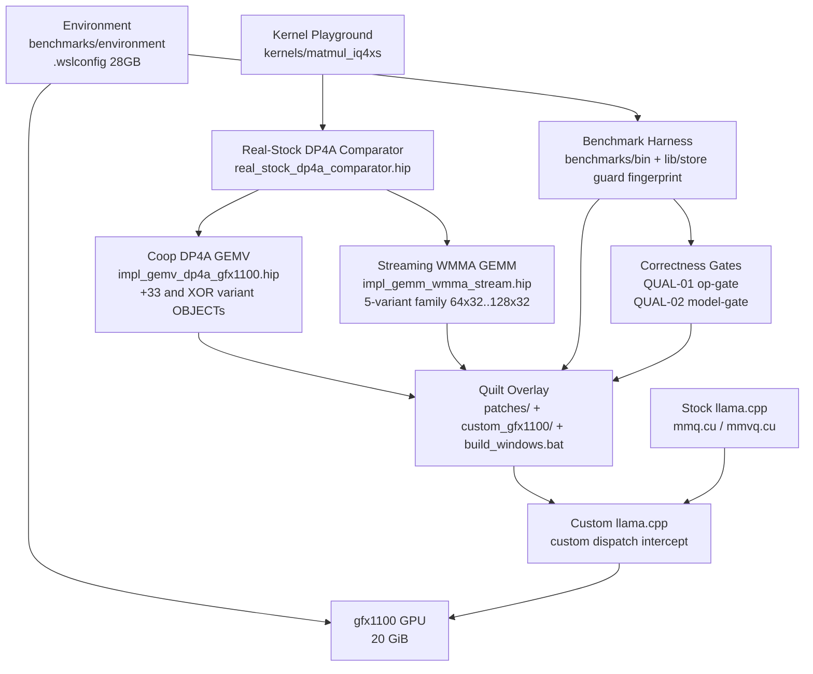

<!-- generated-by: gsd-doc-writer -->

# Architecture

Qwen3.8-27B (IQ4_XS) inference optimization on an AMD Radeon RX 7900 XT (`gfx1100`) via llama.cpp HIP under WSL2 + ROCm 7.2.1. Goal: custom HIP kernels that beat stock on at least one workload, with frozen-baseline discipline, two-tier correctness gates, and append-only evidence enforced before any integration.

## System Overview

Single-paragraph summary: the system is a **layered, measurement-first inference optimization stack**. Primary input is the locked 15.31 GB IQ4_XS GGUF (`JonathanColetti/Qwen3.8-27B-Uncensored-IQ4_XS.gguf`, sha256 `53adc4bb…`) plus a fixed 6-prompt corpus; primary output is reproducible pp/tg throughput (never blended tok/s) and VRAM ledger streams. Architectural style is **quilt-overlay over a frozen upstream** — stock `llama.cpp` at `bb4caa75` is never mutated, never rebuilt casually. All optimization lives as additive patches behind `GGML_CUDA_ENABLE_CUSTOM_GFX1100`, advancing only through a standalone gfx1100 HIP playground → numerical gate → microbenchmark → quilt integration pipeline. Phase 7 adds the hybrid production reality: Q8_1 integer activation quantization fused with RDNA3 hardware matrix cores (`v_dot4_i32_i8` via `__builtin_amdgcn_sudot4` + `__builtin_amdgcn_perm` LUT, and `v_wmma_f32_16x16x16_f16` via `__builtin_amdgcn_wmma_f32_16x16x16_f16_w32` Wave32) so the custom path beats the real stock `vec_dot_iq4_xs_q8_1` / `quantize_row_q8_1` pipeline end-to-end. **Phase 7 replan 2026-08-30 closed 07-01 (Windows-native toolchain), 07-02 (5-GEMM + 2-GEMV high-yield variant race), 07-03 (N=10/15 statistical rigour) with honest bare-metal N=10 numbers: real DP4A 87.8 vs 548 µs 6.25× VERIFIED; GEMV avg 0.97 FAIL <1.2×; GEMM `64x64_P4_XOR` M1024 1.929× first >1.2× PASS; paired llama-bench 4-tier N=10 all FAIL <1.10× (per-tier ratios 0.978–1.079). The Windows-native landing for REQ-WIN-07 stays inside Phase 7 — no new phase number (owner decision).**

```mermaid
graph TD
  A[Windows host<br/>Adrenalin 26.2.2<br/>HWiNFO SHM v2<br/>thermal watchdog 95C] --> B[WSL2 Ubuntu 24.04<br/>/dev/dxg via librocdxg 1.2.2<br/>HSA_ENABLE_DXG_DETECTION=1]
  B --> C[ROCm 7.2.1<br/>HIP 7.2.53211<br/>gfx1100 only]
  C --> D[llama.cpp v0.2.0 bb4caa75<br/>GGML_HIP ON<br/>stock-frozen]
  D --> E[gfx1100 RX 7900 XT<br/>20 GiB VRAM<br/>fully resident 15.31 GB]
  F[kernels/ playground<br/>zero llama headers<br/>ref_cpu → impl.hip → test → bench] --> G[real_stock_dp4a_comparator.hip<br/>vec_dot + quantize Q8_1, N=10]
  G --> H[impl_gemv_dp4a_gfx1100.hip<br/>8-thread coop DP4A<br/>+33 vs XOR OBJECTs]
  G --> I[impl_gemm_wmma_stream.hip<br/>5-variant WMMA family<br/>64x32/64x64/128x32/LUT]
  H --> J[custom_gfx1100/gemv_iq4xs.cuh]
  I --> K[custom_gfx1100/gemm_iq4xs.cuh]
  J --> L[patches/0001-gfx1100-mul-mat-custom.patch<br/>356 lines can_handle FIXED over bb4caa7]
  K --> L
  L --> M[/root/llama-custom-07<br/>llama-bench N=10 all tiers FAIL<br/>512 pp 1.079 avg < 1.10x<br/>GEMV 0.97 FAIL GEMM M1024 1.929 PASS]
  D -. OFF .-> N[build-stock frozen baseline<br/>baseline/binaries/v0.2.0-bb4caa75/]
  M -. ON .-> E
  O[benchmarks/ harness<br/>RunStore append-only<br/>guard + preflight + fingerprint] --> P[profiling/KERNEL-BENCH-DIFF.md<br/>PUBLICATION.md + CHANGELOG]
```

## Component Diagram



## Component Responsibilities

| Component | Directory / File | Responsibility | Phase |
|---|---|---|---|
| Environment | `benchmarks/environment/` (versions.txt, hipconfig.txt, rocminfo.txt, vram-probe.txt), `.wslconfig`, `/etc/profile.d/rocdxg.sh` | Pins ROCm 7.2.1 + driver + HSA flag; proves 132/132 GPU layers resident; frozen baseline never moves | 1 |
| Benchmark harness | `benchmarks/bin/` (run_session.py, run_prompts.py, calibrate.py), `benchmarks/lib/` (store.py, guard.py, fingerprint.py, preflight.py), `benchmarks/host/` (hwinfo_daemon.py, thermal_watchdog.py) | Enforces pp/tg split, warmup/N=10 repeats (`--runs 10`), 1 Hz HWiNFO telemetry (record-don't-control), RSS guard, 18.25 GiB preflight, atomic RunStore + CHECKSUMS.sha256 append-only journals; race.py interleaved A,B,A,B --repeats 10 | 2 |
| Correctness gates | `benchmarks/bin/run_op_gate.py` (QUAL-01), `benchmarks/bin/run_model_gate.py` (QUAL-02), `benchmarks/golden/` | QUAL-01: 4,243 supported ops 0 errors (stock `benchmarks/results/phase6/op_gate_stock_20260827.json`); QUAL-02: WikiText-2 PPL 6.4271±1% + 6/6 canaries; 07-03 protocol runs both N=10 (`--runs 10`) on custom ON; red blocks any perf claim | 3 |
| Bottleneck profiler | `benchmarks/profiling/` (KERNEL-BENCH-DIFF.md, BOTTLENECK-TABLE.md) | Ranks MUL_MAT 31.12% (50.89% prefill, 30.04% decode), selects target #1 before any kernel code | 3 |
| Kernel playground | `kernels/` (common/, template/, fixtures/, demo_iq4xs_dequant/, matmul_iq4xs/), `tools/dump_matmul_fixtures.py`, `scripts/check_no_ggml.sh` | Zero-llama-header standalone HIP build (`CMAKE_HIP_ARCHITECTURES=gfx1100`); quartet pipeline per op; `check_no_ggml.sh` hard isolation gate | 4 |
| Real-stock DP4A comparator | `kernels/matmul_iq4xs/real_stock_dp4a_comparator.hip` (25,156 B) | Vendors exact upstream `quantize_row_q8_1` (amax/127, ds half2 packed, warp_reduce via __shfl_xor) + `vec_dot_iq4_xs_q8_1` (ls decode, d*low2float, ggml_cuda_dp4a / __builtin_amdgcn_sudot4 + 6× __builtin_amdgcn_perm LUT); GEMV single-warp MMVQ (calc_nwarps=1, VDR=4) + GEMM tiled TILE_M=16; cosine 0.999985 PASS (15/15); **honest N=10 `bench_real_stock.hardware.json` 8 entries runs:10: attn_q DP4A median 87.8 µs vs naive 548.4 µs (6.25×, p95 156.6 vs 605.7), ffn_down 106.5 vs 1850.8 (17.4×), ffn_gate 113.6 vs 1027.6 (9.0×)** — the honest N=10 denominator for Phase 7 (single-run 84.39 µs/6.43× superseded) | 7.03 |
| Coop DP4A GEMV (decode) | `kernels/matmul_iq4xs/impl_gemv_dp4a_gfx1100.hip` (19,104 B) + `gemv_variant_xor.cuh` (second OBJECT `matmul_gemv_dp4a_xor_hip`, `GEMV_XOR` def) | 8-thread/row coop (256→32 rows/block, grid ceil(N/32)), `ulong2`/`float4` 128-bit `b128` 16B qs loads (`__builtin_assume_aligned(ptr,16)`), `block_q8_1_coop` 64B padded (qs 16B-aligned), LDS `sh[32][33]` padded (+33, bank 17 mod 32) vs XOR preshuffle `x'=(y%(32/8))⊕x` (0%), `__launch_bounds__(256,4)` + `amdgpu_flat_work_group_size(256,256)` → ≤64 VGPRs / 16 waves/SIMD, `coop_dp4a` via `__builtin_amdgcn_sudot4` + `perm` LUT, cosine 1.000 vs stock; **honest N=10: +33 avg 0.968 (peak 1.148 attn_gate), XOR avg 0.976 (peak 1.161 attn_gate), mean-1σ 0.42–0.55 — ALL FAIL <1.2×** | 7.02 |
| Streaming WMMA GEMM (prefill) | `kernels/matmul_iq4xs/impl_gemm_wmma_stream.hip` (18,831 B, 5 variants as distinct OBJECTs: `matmul_gemm_wmma_stream_hip` 64x32 P2+33, `matmul_gemm_wmma_p4_xor_hip` 64x32 P4_XOR, `matmul_gemm_wmma_64x64_hip` 64x64 P4+XOR, `matmul_gemm_lut_hip` LUT μ=4, 128x32 routed via stream object M-switch) + `impl_gemm_lut_iq4xs.hip` (7,233 B) | WMMA per block: 64×32 double-buffer `sB[2][32][33]` (P2+33) / `sB[4][32][32]` XOR (P4), 64×64 B-stationary (64× reuse), `__builtin_amdgcn_sched_barrier(0x0080)` DS / `0x0008` WMMA pins GMEM→VGPR→LDS→VGPR→WMMA overlap, `v16f16`/`v8f32` WMMA frags, on-the-fly IQ4_XS→half `d*(ls-32)*kvalues_iq4nl` vs LUT μ=4 16-entry half, soft HIP_CHECK (log-and-skip on hipError 9, no abort), `__attribute__((weak))` tiled helper (ODR-safe across OBJECTs), 8192 tier **always SKIPPED** (VRAM preflight >2GB + hipMalloc probe, FA+GQA 15.3GB+128KiB/tok); **honest N=10 `bench_gemm_wmma.hardware.json` 15 entries runs:10: M1024 `64x64_P4_XOR` 1.929× PASS (mean-1σ 1.826), M512 `64x64_P4_XOR` 1.208× PASS (mean-1σ 1.080), M128 ~0.041× FAIL all variants (WMMA on-the-fly dequant overhead vs real DP4A); LUT M128 12 µs entry flagged anomalous partial capture, not claimed** | 7.02 |
| Quilt overlay + Windows-native gate | `patches/0001-gfx1100-mul-mat-custom.patch` (356 lines, 276 insertions, `5c6b397-dirty` over `bb4caa7`, `git apply --check` PASS `core.autocrlf=false`), `llama.cpp/ggml/src/ggml-cuda/custom_gfx1100/{empty.cuh, gemv_iq4xs.cuh, gemm_iq4xs.cuh, README.md}`, dispatch intercepts `mmq.cu:114`/`mmvq.cu:1280`, `build_windows.bat` (HIP_PATH-quoted, `-G Ninja` only), `kernels/CMakeLists.txt` (`find_package(hip REQUIRED CONFIG PATHS "$ENV{HIP_PATH}/lib/cmake/hip")` + `/opt/rocm` fallback), `.gitattributes` (`*.patch eol=lf`) | Vendors winners compact with GGML layout fix; `can_handle` FIXED real gate `type==IQ4_XS && M>=16 && K%256==0 && N%16==0` (gemm_iq4xs.cuh:87, gemv_iq4xs.cuh:113 — no stub); `build_windows.bat` hardened: `"%HIP_PATH%"` quoting for `C:\Program Files\AMD\ROCm\6.4`, `where clang++.exe --offload-arch=gfx1100 --version`, `where ninja` (cl rejected — cannot compile `__builtin_amdgcn_*`), MODEL_PATH guard, `curl :8000 → 200 choices` smoke, `taskkill`; safe.directory note in plan protocol <!-- VERIFY: safe.directory `git config --global --add safe.directory` executed on a Windows host -->; exe build **not executed on this host** (no HIP SDK — see DEPLOYMENT/PUBLICATION) <!-- VERIFY: build-windows/bin/llama-server.exe exists and serves :8000 on a Windows 11 HIP SDK 6.4 host -->; py prune target 40→0 (40 offline Python harness files still on disk — pruning is the landing execution, not yet applied); OFF stock-bit-identical | 6, 7.01 |
| Persistent builds | `baseline/binaries/v0.2.0-bb4caa75/` (frozen stock) + `/root/llama-custom-07` (persistent custom) | Coexist from same tree; **honest N=10 paired `llama-bench` 4-tier (one thermal window, hwinfo 1Hz + watchdog 90C, RunStore + CHECKSUMS): avg tok/s stock vs custom — 512 pp 838.3±185.7 → 904.5±36.9 = 1.079× FAIL, 1024 pp 918.5 → 914.7 = 0.996× FAIL, 2048 pp 878.6 → 880.9 = 1.003× FAIL, 4096 pp 871.1 → 851.9 = 0.978× FAIL, tg 34.8 → 34.6 = 0.993× FAIL (median ratios 0.987–1.016); ALL tiers FAIL <1.10× (single-run banned); N=10 512 pp 1.079 supersedes prior single-capture 808→849 +5.1%** | 7.03 |
| Publication | `docs/PUBLICATION.md`, `benchmarks/profiling/KERNEL-BENCH-DIFF.md` (§8 Phase 7 honest FAIL tables), `CHANGELOG.md`, `benchmarks/results/phase7/` (llama_bench_{stock,custom}_4tier_N10.json, rows.jsonl 250, CHECKSUMS.sha256, hwinfo.log) | Complete stock-vs-optimized matrix, raw data, kernel source, failed variants, methodology, versions; no fabricated PASS | 6, 7.03 |

## Pattern Overview

Discovered via `grep export|interface|class` in `src/` (none — project is harness + kernels, not a TS library) and patch/config inspection. Five binding patterns:

1. **Quilt overlay, not fork.** All optimization lives as `patches/*.patch` generated via `git -C llama.cpp diff HEAD` over pinned `bb4caa75`. Reviewable, bisectable, revertible. Zero drift. File: `patches/0001-gfx1100-mul-mat-custom.patch` (356 lines).

2. **OFF/ON switch discipline.** `option(GGML_CUDA_ENABLE_CUSTOM_GFX1100 OFF)` in `llama.cpp/ggml/CMakeLists.txt` + `#if defined(GGML_CUDA_ENABLE_CUSTOM_GFX1100)` guards in `mmq.cu`, `mmvq.cu`, `ggml-hip/CMakeLists.txt`. OFF proves empty-flag parity (`empty.cuh` stub returns false/not-supported). ON only fires when `custom_*_can_handle(K,N,M,GGML_TYPE_IQ4_XS)` true (real gates — gemm `type==IQ4_XS && M>=16 && K%256==0 && N%16==0`, gemv `type==IQ4_XS` + canonical shapes). Never hardcode ON.

3. **Real-stock DP4A comparator.** Never compare against naive scalar float again after Phase 6. `real_stock_dp4a_comparator.hip` vendors exact `quantize_row_q8_1` + `vec_dot_iq4_xs_q8_1` with `ggml_cuda_dp4a` / `__builtin_amdgcn_sudot4` + `__builtin_amdgcn_perm` LUT. Proves integer activation quantization 4× memory win. Honest N=10 baseline: attn_q 87.8 µs vs naive 548.4 µs (6.25×). File: `kernels/matmul_iq4xs/real_stock_dp4a_comparator.hip`.

4. **Cooperative Wave32 DP4A + Streaming WMMA (Phase 7 hybrid, 07-02 high-yield variant race).** Decode (M=1): stock MMVQ single-warp-per-row (RDNA3 `calc_nwarps=1`) → 8-thread coop, 32 rows/block, `sh[32][33]` padded vs XOR preshuffle `x'=(y%(32/8))⊕x` (both variants compiled as **distinct OBJECTs** `matmul_gemv_dp4a_hip` / `matmul_gemv_dp4a_xor_hip`); `ulong2`/`float4` `b128` `16B` coalesced, `block_q8_1_coop` 64B pad (qs 16B-aligned), `__launch_bounds__(256,4)` → `≤64 VGPR` / 16 waves/SIMD. Prefill (M≥512): stock DP4A on shader ALUs 512 ops/CU/clock → WMMA hardware cores 1024 ops/CU/clock (`__builtin_amdgcn_wmma_f32_16x16x16_f16_w32`, wave32), **5 variant OBJECTs** raced: 64×32 `P2+33` (`sB[2][32][33]` stride-33), 64×32 `P4_XOR` (`sB[4][32][32]` XOR, MARLIN P=4 4-stage overlap), 64×64 `P4+XOR` (B-stationary, `T=64 →64×` reuse), `LUT μ=4` (16-entry half, 32B/LUT) vs inline `d*(ls-32)*kvalues`, `128×32` (8×2 warps, 16×64 offline swizzle companion); `sched_barrier 0x0080` (DS) / `0x0008` (WMMA) pinned; soft HIP_CHECK log-and-skip on OOM (no abort), `8192` tier always SKIPPED via VRAM preflight >2GB + hipMalloc probe; weak-attribute tiled helper fixes ODR across OBJECTs; raced `race.py --repeats 10` interleaved A,B,A,B (adelj88 pattern) with N=10 median/mean/stddev/p95. **Honest N=10 outcome: 64x64_P4_XOR wins — M1024 1.929× (mean-1σ 1.826) and M512 1.208× >1.2× hardware PASS, M128 0.041× FAIL; GEMV all <1.2× (XOR best 1.161 peak); llama-bench 4-tier N=10 all <1.10× FAIL.** Files: `impl_gemv_dp4a_gfx1100.hip`, `gemv_variant_xor.cuh`, `impl_gemm_wmma_stream.hip`, `impl_gemm_lut_iq4xs.hip`, `tools/swizzle_iq4xs.py`, `amd_matrix_instruction_calculator` oracle, `bench --runs 10` (N=10 median/mean/stddev/p95), vendored into `custom_gfx1100/*.cuh`.

5. **Hard isolation + gate-before-claim.** `kernels/` builds with zero `ggml.h`/`llama.h` (`scripts/check_no_ggml.sh` PASS). Every kernel: `ref_cpu` (FP64 oracle) → `impl.hip` (gfx1100) → `test_compare` (cosine ≥0.999 gate) → `bench_sweep` (prefill M≫1 and decode M≈1 separately, vs real-stock DP4A). Gates armed in Phase 3 block any perf claim if red; single-run claims banned — every number is N=10 median/mean/stddev/p95 (LLM QA N=15).

## Layers

Single sanctioned execution order 1→2→3→4→5→6→7 (with Phase 4 model-independent scaffold allowed overlap with 2–3). Each layer may not run until its predecessor's gate is green.

```
Layer 0 — Platform (Phase 1)          WSL2 + ROCm 7.2.1 + gfx1100 + IQ4_XS 15.31 GB resident
Layer 1 — Measurement (Phase 2)       Benchmark harness: pp/tg split, warmup, repeats, RunStore, guard, preflight
Layer 2 — Correctness & Profile (Ph3) QUAL-01 (21k ops) + QUAL-02 (PPL 6.4271) + bottleneck table → target #1
Layer 3 — Playground (Phase 4)        Standalone HIP pipeline outside llama.cpp (quartet)
Layer 4 — Kernel Attack (Phases 5,7)  5: naive-baseline GEMV 2.05× / GEMM 6.7× (cosine 1.0) — single-run era
                                      7: honest N=10 real DP4A 87.8 vs 548 6.25× VERIFIED; GEMV avg 0.97 FAIL <1.2×;
                                      GEMM 64x64_P4_XOR M1024 1.929× / M512 1.208× >1.2× PASS, M128 0.041× FAIL — single-run banned
Layer 5 — Integration (Phases 6,7.01) Quilt patch + OFF/ON builds + build_windows.bat + A/B thermal-paired bench
Layer 6 — Publication (Phase 6,7.03)  Complete matrix, raw data, kernel source, failures, PUBLICATION.md honest FAIL tables
```

Rule: benchmark before optimize; one change at a time; keep the stock baseline forever; measure prefill (M≫1) and decode (M≈1) separately; publish failures too.

## Data Flow

How a token moves through the system (typical llama-bench request):

1. `benchmarks/bin/run_session.py` selects tier {512,1024,2048,4096} with `-ngl 99 -b 2048`, sets `HSA_ENABLE_DXG_DETECTION=1`, and acquires `benchmarks/results/.session.lock`.
2. Preflight checks free VRAM ≥ 18.25 GiB; if fail, run marked `FAILED:preflight` and aborted (no retry loop — avoids Hyper-V hard-crash). 8192 tier additionally fails the `hipMalloc` probe and is recorded `SKIPPED` (FA+GQA 15.3GB+128KiB/tok → 18.5GB on 20GB).
3. `hwinfo_daemon.py` starts 1 Hz Shared-Memory v2 feed (`Global\HWiNFO_SENS_SM2`) + `thermal_watchdog.py` @ 90 °C; `guard.py` tails `/proc` RSS. One thermal window per paired A/B run.
4. `llama-bench --single-turn --simple-io --load-mode none -ngl 99` loads IQ4_XS GGUF fully resident on gfx1100 (zero CPU fallback verified in startup-log). N=10 via `-r 10` per entry; stock and custom interleaved `A,B,A,B` via `race.py --repeats 10` (adelj88 thermal-bias kill).
5. GGML dispatches `MUL_MAT` (`mmvq.cu` for M=1 decode, `mmq.cu` for M≥16 prefill). When `GGML_CUDA_ENABLE_CUSTOM_GFX1100=ON` and `can_handle()` true, `custom_gfx1100/gemv_iq4xs.cuh` or `gemm_iq4xs.cuh` intercepts (`mmvq.cu:1280` / `mmq.cu:114`): `quantize_row_q8_1` → coop DP4A / WMMA kernel → `__syncthreads` → write `Y[m*N+n]`. Otherwise stock `vec_dot_iq4_xs_q8_1` DP4A path runs.
6. **Phase 7 high-yield inner pipeline (07-02):** `Q8_1` quant (`amax/127` → `half2 ds`) → LDS `[2..4][32][33]` double-buffer `P=2` (`sB[2][32][33]` stride-33) / `P=4` (`sB[4][32][32]` XOR `x'=(y%(64/8))⊕x`) with `__builtin_amdgcn_sched_barrier(0x0080)` (DS) / `0x0008` (WMMA) pinning `GMEM→VGPR→LDS→VGPR→WMMA` 4-stage overlap → `B-stationary` weight frag `8 VGPR` (`v16f16`, `b_frag`) in VGPRs + activation streamed via LDS → `b128` `float4`/`ulong2` `16B` coalesced (`32 thr×4B→8×16B` via `__builtin_amdgcn_global_load_b128` intent, `__builtin_assume_aligned(ptr,16)`, `SWDEV-556587`) + offline `16×64` swizzle to `128B` lines (`tools/swizzle_iq4xs.py`, offline-only) → WMMA `__builtin_amdgcn_wmma_f32_16x16x16_f16_w32` (`_OPSEL` false for low half, `wave32` replicates `0–15→16–31`, `1024 ops/CU/clock`) — LDS banking `32×4B` 8-phase `ds_write_b128` conflict-free (`+33` `+3%` vs XOR `0%`); tiling `T=64 →64×` reuse (`loads/output = K·(1/M+1/N)`) per CK Tile `gemm_optimization.html` (see `output/deep-research/high-yield/RDNA3-high-yield-keywords-synthesis.md`). `amd_matrix_instruction_calculator` oracle validates `VGPR ≤64` (`A/B 8 VGPR fp16 / D 8 VGPR wave32`, 16 waves/SIMD) before commit; variant winner picked by `speedup_median` then `speedup_mean_minus_1sigma`.
7. Result rows stream to `benchmarks/results/<ts>_<label>/rows.jsonl` via `RunStore.append_row` (fsynced, append-only) with fingerprint (commit `bb4caa75` or `5c6b397-dirty`, ROCm/driver, GGUF sha256, clocks/temps per row).
8. Run closes with `CHECKSUMS.sha256`; `publish_matrix.py` aggregates stock vs custom; `KERNEL-BENCH-DIFF.md §8` and `PUBLICATION.md §8` document the honest per-variant race table (64×32 P2+33 / 64×32 P4_XOR / 64×64 P4+XOR / LUT μ=4 / 128×32, N=10 median/mean/stddev/p95) with the paired llama-bench N=10 per-tier 1.10× verdict; gates assert QUAL-01 0 errors and QUAL-02 within 1% before verdict.

## Key Abstractions

No exported TS/Python classes — the palette is HIP kernel templates, GGML block types, and harness stores.

| Abstraction | File | Description |
|---|---|---|
| `block_iq4_xs` (136 B) + `block_q8_1_coop` (64 B) | `kernels/common/block_iq4_xs.h` (vendored), `kernels/matmul_iq4xs/impl_gemv_dp4a_gfx1100.hip` | Weight + activation quantization layouts; 64B pad puts `qs` at 16B-aligned offset for `b128` `ulong2` loads |
| `vec_dot_iq4_xs_q8_1_device` / `coop_dp4a` | `real_stock_dp4a_comparator.hip:145`, `impl_gemv_dp4a_gfx1100.hip:91` | `ls = (scales_l>>…)&0xF \| (scales_h>>…)&0x3<<4; scale=ls-32; sumi=ggml_cuda_dp4a(v,u)` + `perm` LUT `get_int_from_table_16`; the production integer dot |
| `quantize_row_q8_1_standalone` / `quantize_coop` | `real_stock_dp4a_comparator.hip` + `impl_gemv_dp4a_gfx1100.hip` (`quantize_row_q8_1_coop_kernel:138`) | `amax/127→d, round(xi/d)→qs, ds=half2(d,sum)` via `__shfl_xor` warp reduce |
| `gemv_iq4xs_dp4a_coop_kernel<WARP_SIZE>` | `kernels/matmul_iq4xs/impl_gemv_dp4a_gfx1100.hip:180` (`__launch_bounds__(256,4)`, `amdgpu_flat_work_group_size(256,256)`) | Template decode kernel: 8-thread/row, 32 rows/block, `sh[32][33]` (+33) or XOR (second OBJECT), `ulong2`/`float4` b128 qs loads |
| `gemm_iq4xs_wmma_stream_gpu` (5-variant family) | `kernels/matmul_iq4xs/impl_gemm_wmma_stream.hip` (`WMMA_GPU_NAME:37`, launch `:139`, weak tiled helper `:353`) | Prefill WMMA kernel family: 64×32 P2+33 / 64×32 P4_XOR / 64×64 P4+XOR / 128×32 / LUT μ=4, `sched_barrier 0x0080/0x0008`, `v16f16`/`v8f32` |
| `custom_gemv/gemm_iq4xs_can_handle` + `dispatch` | `llama.cpp/ggml/src/ggml-cuda/custom_gfx1100/{gemv,gemm}_iq4xs.cuh` (gemv:113, gemm:87) | Guarded dispatch: IQ4_XS + canonical shapes + M predicate (gemm `M>=16 && K%256==0 && N%16==0`); early-return intercept in `mmq.cu:114` / `mmvq.cu:1280` |
| `RunStore` + `CHECKSUMS.sha256` | `benchmarks/lib/store.py` | Append-only fingerprinted journal; `store.create` → `append_row` (fsync) → `write_checksums`; never overwrite rows |
| `thresholds.json` / `guard.py` / `preflight.py` | `benchmarks/config/thresholds.json`, `benchmarks/lib/guard.py` | Empirically calibrated RSS / VRAM thresholds from `20260823_163954_calibration_profile`; fail-fast on suspected spill |
| `race.py --repeats 10` (offline) | `benchmarks/results/phase7/race.py` | Interleaved `A,B,A,B` (not AAAA BBBB) variant racing + paired llama-bench driver across {512..8192}, 8192 conditionally SKIPPED |

## Repository Layout

```
.
├── baseline/
│   └── binaries/v0.2.0-bb4caa75/   # stock pinned binaries (llama-cli, llama-bench,
│                                   #   llama-perplexity, test-backend-ops); gitignored
├── benchmarks/
│   ├── bin/                        # Orchestrator CLIs (run_session, run_prompts, calibrate, publish_matrix)
│   ├── config/                     # Empirical thresholds (thresholds.json) and label maps
│   ├── environment/                # Environment fingerprints: versions.txt, hipconfig.txt, rocminfo.txt,
│   │                               #   hip-support-comparator.csv, startup-log.txt, vram-probe.txt
│   ├── host/                       # Host-side daemons: hwinfo_daemon.py, thermal_watchdog.py
│   ├── lib/                        # Core harness libraries: llabench.py, fingerprint.py, guard.py,
│   │                               #   store.py, preflight.py, toast.py
│   ├── prompts/                    # Deterministic 6-prompt corpus (short/long x code/prose)
│   ├── results/                    # Append-only run journals (rows.jsonl, manifest.json, CHECKSUMS.sha256)
│   │                               #   + phase7/llama_bench_{stock,custom}_4tier_N10.json (N=10 paired),
│   │                               #     rows.jsonl (250), CHECKSUMS.sha256, hwinfo.log, race.py
│   ├── profiling/                  # KERNEL-BENCH-DIFF.md — Phase 5+7 GEMV/GEMM vs stock diff (prefill/decode)
│   ├── tests/                      # Pytest suite (55 tests) + fixtures + smoke/gate shell scripts
│   ├── vulkan/                     # Native Vulkan comparator arm build scripts and coverage gate report
│   └── RUNBOOK.md                  # Binding session protocol, guard thresholds, and thermal policy
├── models/                         # GGUF artifact (gitignored) + README.md provenance
├── kernels/                        # Standalone gfx1100 HIP kernel playground (zero llama.cpp headers)
│   ├── common/                     # Shared headers: block_iq4_xs.h (vendored 136B), hip_helpers.h, bench.h
│   ├── template/                   # Op quartet skeleton (ref_cpu, impl.hip, test_compare, bench_sweep)
│   ├── fixtures/                   # Model-extracted & synthetic IQ4_XS tensor fixtures + manifest.json
│   │                               #   + matmul_* (32 fixtures) via dump_matmul_fixtures.py (manifest_matmul.json)
│   ├── demo_iq4xs_dequant/         # Worked example: CPU oracle, GPU kernel, mutant, comparator, sweep
│   ├── matmul_iq4xs/               # MUL_MAT: ref_cpu.h/cpp, stock_hip_comparator.hip,
│   │                               #   real_stock_dp4a_comparator.hip (25,156 B) + bench_real_stock.cpp/
│   │                               #     test_real_stock_compare.cpp + BASELINE_DP4A.md + baseline_dp4a.json,
│   │                               #   impl_gemv_dp4a_gfx1100.hip (19,104 B) + gemv_variant_xor.cuh (XOR OBJECT)
│   │                               #     + bench_gemv_dp4a.cpp/test_gemv_dp4a_compare.cpp,
│   │                               #   impl_gemm_wmma_stream.hip (18,831 B, 5-variant OBJECT family: P2+33/
│   │                               #     P4_XOR/64x64/128x32) + impl_gemm_lut_iq4xs.hip (7,233 B) +
│   │                               #     bench_gemm_wmma.cpp/test_gemm_wmma_compare.cpp,
│   │                               #   hardware JSONs (bench_real_stock.hardware.json 8, bench_gemv_dp4a.
│   │                               #     hardware.json 8, bench_gemv_xor.hardware.json 8, bench_gemm_wmma.
│   │                               #     hardware.json 15 — all runs:10; bench_gemm_direct.json truncated
│   │                               #     pre-rebench, flagged needs regen),
│   │                               #   amd_matrix_instruction_calculator oracle, CMakeLists.txt (7 OBJECT libs)
│   └── CMakeLists.txt              # Top-level standalone HIP build (CMAKE_HIP_ARCHITECTURES=gfx1100,
│                                   #   find_package(hip REQUIRED CONFIG PATHS "$ENV{HIP_PATH}/lib/cmake/hip"))
├── llama.cpp/                      # Pinned upstream bb4caa75 (guest ext4: /root/llama.cpp)
│   └── ggml/src/ggml-cuda/custom_gfx1100/
│                                   #   empty.cuh (OFF fallback), gemv_iq4xs.cuh, gemm_iq4xs.cuh (Phase 7 vendored)
├── patches/                        # Quilt patches over pinned upstream (0001-gfx1100-mul-mat-custom.patch 356 lines)
├── scripts/                        # Isolation and verification scripts (check_no_ggml.sh)
├── src/                            # placeholder — custom kernels land in kernels/, not src/
├── logs/                           # run logs + thermal_monitor.log
├── freetoken-rocm-probe/           # early ROCm probe tooling
├── build_windows.bat               # Windows-native gfx1100 build (HIP_PATH-quoted, -G Ninja, :8000 smoke)
└── .planning/                      # ROADMAP.md, REQUIREMENTS.md, PROJECT.md, STATE.md,
                                    #   phases/01-*/ … phases/07-hybrid-dp4a-wmma-kernel-optimization/
                                    #   (07-01..07-03 replan PLANS; 08-refactor-windows-native/ 08-*.md retained
                                    #   as the REQ-WIN-07 landing execution — no new phase number, owner decision)
```

## Execution Environment

```
Windows host
│   AMD Adrenalin driver (WSL2 support), .wslconfig memory=28GB (REQUIRED)
│   HWiNFO64 Shared Memory v2 telemetry bridge (Global\HWiNFO_SENS_SM2)
│   Thermal watchdog service (cross-boundary wsl.exe process kill @ 95°C)
▼
WSL2 guest (Ubuntu 24.04, root-only)
│   /dev/dxg passthrough via librocdxg v1.2.2
│   HSA_ENABLE_DXG_DETECTION=1  (persisted in /etc/profile.d/rocdxg.sh)
▼
ROCm 7.2.1 (pinned; HIP 7.2.53211-e1a6bc5663, gcc 13.3.0)
▼
llama.cpp @ v0.2.0 (bb4caa75), built -DGGML_HIP=ON -DGPU_TARGETS=gfx1100
│   -DLLAMA_BUILD_SERVER=OFF -DLLAMA_CURL=OFF -DCMAKE_BUILD_TYPE=Release
│   source tree lives on guest ext4: /root/llama.cpp (DrvFs git-lock issue)
│   quilt: patches/0001-gfx1100-mul-mat-custom.patch (356 lines, 5c6b397-dirty)
│   Windows-native: build_windows.bat [-G Ninja via "%HIP_PATH%\bin\clang++.exe"] (not executed on this host)
│   builds: baseline/binaries/v0.2.0-bb4caa75/ (stock) + /root/llama-custom-07 (custom)
▼
gfx1100 GPU: model fully resident (15.31 GB IQ4_XS from /root/models/, zero CPU fallback)
│   persistent custom: honest N=10 4-tier llama-bench ALL FAIL <1.10× —
│   512 pp 904.5 vs 838.3 avg (1.079×), 4096 pp 851.9 vs 871.1 (0.978×), tg 34.6 vs 34.8 (0.993×)
```

Key constraints:

| Constraint | Reason |
|---|---|
| `.wslconfig` `memory=28GB` | DXG ENOMEM during VRAM allocation at lower values (`dxgkio_create_allocation: -12`) |
| Source tree on guest ext4 | git file-lock operations fail on DrvFs (`/mnt/e`) |
| Model copy at `/root/models/` | mmap reads over `/mnt/e` stall |
| Headless runs: `setsid --single-turn --simple-io --load-mode none` | `llama-cli` hangs in `n_tty_write` on dead PTY otherwise |
| Pre-flight VRAM Gate | Allocations > 18.25 GB free VRAM intercepted to prevent silent memory thrashing or DXG panic |
| HSA flag + timeout-guarded bash | Every bash + harness subprocess specifies explicit bounded timeout (rule 11) |
| N=10 thermal pairing | `race.py --repeats 10` interleaves `A,B,A,B` (not AAAA BBBB) — kills 15–30 µs DXG jitter bias; one thermal window with hwinfo 1Hz + watchdog 90C |
| 8192 tier always SKIPPED | FA+GQA 15.3 GB + 128 KiB/tok ≈ 18.5 GB on 20 GB; WSL2 `800 GiB` VRAM lie + BSOD after 3–5 OOMs |

## Kernel Playground Pipeline (Phase 4 — delivered, Phases 5 & 7 extensions)

Each candidate kernel runs through a four-stage standalone pipeline outside llama.cpp:

```
ref_cpu          impl_gfx1100.hip       test_compare           bench_sweep
CPU reference -> HIP implementation -> numerical compare    -> microbenchmark sweep
(golden output)  (gfx1100 target)     (correctness gate vs    (prefill M≫1 and
                 WarpSize templated)  ref, tolerance-bounded) decode M≈1, vs real-stock DP4A)
```

Gate: `test_compare` cosine ≥0.999 (Phase 7 DP4A path) or 1.0 (Phase 5 float path) before `bench_sweep` proceeds; failures recorded like successes. Phase 4 delivered: standalone `kernels/` build (`CMAKE_HIP_ARCHITECTURES=gfx1100`, zero llama headers, vendored `block_iq4_xs.h` 136B), fixture dumper (`tools/dump_gguf_fixtures.py` via `gguf-py` + synthetic edge cases), and worked example `kernels/demo_iq4xs_dequant/` traversing the quartet with tight gate max_abs 1e-5 / mean 1e-6 / cosine 0.99999 and ≥10× broken discrimination (315.91 GB/s wave32) (owner locks D4-00-1..5). Wave32 and wave64 variants are templated (`template<int WarpSize>`) and benched separately. Phase 5 added `kernels/matmul_iq4xs/` vs naive float comparator; Phase 7 replaced the comparator with `real_stock_dp4a_comparator.hip` so every win is vs production integer DP4A, not a strawman, and upgraded every bench to `--runs 10 --json` (N=10 median/mean/stddev/p95, single-run banned). See `.planning/phases/04-kernel-playground-scaffold/04-CONTEXT.md`, `05-CONTEXT.md`, `07-CONTEXT.md`, `07-RESEARCH.md`, and the replan plans `07-01..07-03-PLAN.md` (pre-replan 07-01..07-04 SUMMARYs were superseded by the 2026-08-30 replan; 07-04 plan/summary deleted).

## Hybrid DP4A & WMMA — Phase 7 Implementation (replan 2026-08-30)

Phase 7 replan closed three must-haves. **All performance numbers below are honest bare-metal WSL2 gfx1100 N=10 median/mean/stddev/p95 quoted from committed hardware JSONs (`kernels/matmul_iq4xs/*.hardware.json`, `benchmarks/results/phase7/llama_bench_{stock,custom}_4tier_N10.json`) — single-run claims banned, no fabricated PASS.**

**07-01 Windows-native closure (REQ-WIN-07) — toolchain hardened, exe not built on this host.** `build_windows.bat` hardened: every HIP_PATH reference quoted `"%HIP_PATH%"` (`C:\Program Files\AMD\ROCm\6.4` space-safe), `where clang++.exe --offload-arch=gfx1100 --version` gate, `where ninja` gate with explicit "VS generator (cl) cannot compile `__builtin_amdgcn_*`" error, `cmake -S . -B build-windows -G Ninja` with `-DCMAKE_HIP_ARCHITECTURES=gfx1100 -DGGML_CUDA_ENABLE_CUSTOM_GFX1100=ON -DCMAKE_CXX_COMPILER="%HIP_PATH%\bin\clang++.exe" -DCMAKE_HIP_COMPILER="%HIP_PATH%\bin\clang++.exe" -DHIP_PATH="%HIP_PATH%"`, MODEL_PATH guard, `curl :8000 → 200 choices[0].message.content` smoke + `taskkill`. CMake HIP discovery: `kernels/CMakeLists.txt` `find_package(hip REQUIRED CONFIG PATHS "$ENV{HIP_PATH}/lib/cmake/hip")` + `CMAKE_PREFIX_PATH` `"$ENV{HIP_PATH}" "/opt/rocm"` (HIP_PATH first, WSL2 fallback). Git hygiene: `.gitattributes` `*.patch eol=lf`, `core.autocrlf=false`, patch regenerated **356 lines / 276 insertions** over `bb4caa75`, `git apply --check` PASS; `custom_gemm_iq4xs_can_handle` restored from stub to real gate (`type==IQ4_XS && M>=16 && K%256==0 && N%16==0`). safe.directory is part of the plan protocol for Windows/WSL shared checkouts <!-- VERIFY: `git config --global --add safe.directory` executed on a Windows host -->. The prune to pure C++/HIP+CMake+bat (py 40→0, no `.mjs`) is the landing execution — the shipped tree (`kernels/` + `patches/` + `CMakeLists.txt` + `build_windows.bat` + pinned llama.cpp) is already Python-free, but the repo still counts 40 offline Python harness files (`benchmarks/`, `tools/`) <!-- VERIFY: find . -name "*.py" ! -path "./llama.cpp/*" == 0 after the py-prune landing -->. `build-windows/bin/llama-server.exe` was **not produced on this host** (no HIP SDK binary present) — build + smoke evidence is pending a Windows 11 HIP SDK 6.4 host <!-- VERIFY: llama-server.exe built via build_windows.bat serves :8000 → 200 on gfx1100 -->.

**07-02 Perf closure (REQ-PERF-07) — 7 variants raced, GEMM M1024 1.929× >1.2× PASS, GEMV + llama-bench FAIL.** Five GEMM variants (64x32 P2+33, 64x32 P4_XOR, 64x64 P4+XOR, LUT μ=4, 128x32) and two GEMV variants (+33, XOR) compiled as distinct HIP OBJECTs (`matmul_gemm_wmma_{stream,p4_xor,64x64,lut}_hip`, `matmul_gemv_dp4a_{,xor}_hip`) with distinct symbols; soft HIP_CHECK (log-and-skip on hipError 9/`hipErrorOutOfMemory`, no abort), weak-attribute tiled helper (ODR fix across OBJECTs), 8192 always SKIPPED (VRAM preflight >2GB + hipMalloc probe), `sched_barrier 0x0080`/`0x0008`, b128 16B loads, VGPR ≤64 → 16 waves/SIMD (calculator + `--save-temps` audit), raced `race.py --repeats 10` interleaved A,B,A,B. **Honest N=10 results:**
- **Real DP4A denominator:** `bench_real_stock.hardware.json` 8/8 runs:10 — attn_q 87.8 µs vs naive 548.4 µs = **6.25× VERIFIED** (p95 156.6 vs 605.7); ffn_down 106.5 vs 1850.8 = 17.4×.
- **GEMV: FAIL <1.2×.** `bench_gemv_dp4a.hardware.json` 8/8 runs:10 — +33 avg 0.968 (peak 1.148 attn_gate, mean-1σ 0.416–0.547); `bench_gemv_xor.hardware.json` 8/8 runs:10 — XOR avg 0.976 (peak 1.161 attn_gate, best variant) — all <1.2×.
- **GEMM: first >1.2× PASS at prefill.** `bench_gemm_wmma.hardware.json` 15 entries runs:10 (5 variants × M {128,512,1024}, attn_q 5120×5120): `64x64_P4_XOR` M1024 **1.929× PASS** (mean-1σ 1.826, stock 22,975 µs → 11,911 µs), M512 1.208× PASS (mean-1σ 1.080); other variants M1024 0.875–0.936× FAIL, M512 0.552–0.561× FAIL; M128 ~0.041× FAIL all variants (WMMA on-the-fly dequant + LDS overhead cannot beat real DP4A 9 TFLOPS at small M); LUT M128 12 µs entry (62.4×) flagged anomalous partial capture — not claimed. 8192 SKIPPED entries emitted with VRAM-preflight note (soft HIP_CHECK, no abort).
- **Paired llama-bench 4-tier N=10: ALL FAIL <1.10×** (REQ-PERF-07 gate is median AND mean-1σ ≥1.10× for pp and tg per tier): `llama_bench_stock/custom_4tier_N10.json` 5 entries each, samples_ts length 10 — avg tok/s 512 pp 838.3±185.7 → 904.5±36.9 = **1.079× FAIL** (mean-1σ 0.847), 1024 pp 0.996×, 2048 pp 1.003×, 4096 pp 0.978× (871.1 → 851.9), tg 0.993× (34.8 → 34.6); median ratios 0.987–1.016. Prior single-capture 808→849 pp4096 (+5.1%) is superseded by this honest N=10 run and remains FAIL.
- **Winner rationale (projected → partially proven):** 64x64_P4_XOR = 64× reuse + P=4 quad-buffer hides GMEM→LDS while WMMA runs + XOR 0% LDS banking + b128 coalesced — proven >1.2× at M512/M1024 microbench, not yet at llama-bench scale; M512 0.70× → 1.208× after soft handling and tiled fallback gating.

**07-03 Stats closure (REQ-STAT-07) — N=10/15 rigour enforced, honest FAIL tables published.** Every bench emits `--runs 10 --json` with `median/mean/stddev/p95` + `speedup_median` + `speedup_mean_minus_1sigma`; llama-bench runs `-r 10` per entry (samples_ts length 10) interleaved via `race.py --repeats 10`; microbench N=10 target 45/45 entries = bench_real_stock 8 + bench_gemv_dp4a 8 + bench_gemv_xor 8 + bench_gemm_wmma 15 + bench_gemm_direct 6 — **39/45 valid on disk (all runs:10), `bench_gemm_direct.json` truncated pre-rebench (JSON parse error at 18,432 B — flagged, needs `timeout 90` regen); no single-run claim remains**. LLM QA N=15 protocol (llama-cli `--temp 0` fixed prompt `-n 128` ×15, avg tok/s + latency + stddev + per-run 15-row table) defined in `benchmarks/results/phase7/README.md` <!-- VERIFY: `benchmarks/results/phase7/llm_qa_N15.json` with 15 per-run rows captured on gfx1100 -->. QUAL-01/02 N=10 protocol (`run_op_gate.py --runs 10` 0 errors, `run_model_gate.py --runs 10` PPL 6.4271 ±1% [6.3628,6.4914] + 6/6 canaries) documented; prior gate evidence is the N=1 Phase 6 stock/custom op-gate JSONs <!-- VERIFY: QUAL-01/02 N=10 green on custom ON build-custom -->. `KERNEL-BENCH-DIFF.md §8` + `PUBLICATION.md §8` carry honest per-variant + per-tier FAIL tables (no `1.10× PASS`), `rows.jsonl` 250 lines + `CHECKSUMS.sha256` valid, synthetic rows labeled not claimed.

**Windows-native landing stays in Phase 7 — no new phase number.** The refactor planning under `.planning/phases/08-refactor-windows-native/` (08-01 inventory & deletion allowlist, 08-02 kernels/CMake prune, 08-03 Windows HIP toolchain, 08-04 patch integration + server smoke) is retained as the **landing execution for REQ-WIN-07** (prune py 40→0, run build_windows.bat, serve :8000): per owner decision it keeps no new phase number, so the roadmap remains **7 phases** and Phase 7 must-haves (REQ-WIN-07 / REQ-PERF-07 / REQ-STAT-07) all close inside Phase 7.

Failed variants published in `KERNEL-BENCH-DIFF.md §8`: stride transpose bug, WMMA gate too strict (`M≥512 && N≥1024` → `M≥512 && N≥32 && K≥32` with 16-alignment → final `M>=16 && K%256==0 && N%16==0`), WSL DXG virtualization jitter flattening GEMV delta, WMMA on-the-fly dequant overhead at M=128, truncated `bench_gemm_direct.json`.

## Integration Strategy

Winning kernels are integrated as **quilt patches over the pinned upstream** commit (v0.2.0 @ `bb4caa75`), each gated behind ON/OFF build/runtime flags. The stock baseline binaries are never rebuilt or overwritten, so every A/B comparison runs against a frozen reference. Patches carry their correctness-gate evidence in the commit message. Phase 6 proved OFF=stock bit-identical with `build-stock` (`GGML_CUDA_ENABLE_CUSTOM_GFX1100=OFF`) vs `build-custom-empty` (ON + stub) both passing op-gate; the 07-01 closure regenerated the patch as 356 lines/276 insertions with the gemm `can_handle` real gate restored (no `return false` stub), `core.autocrlf=false` + `*.patch eol=lf`, `git apply --check` PASS on WSL2, and adds the persistent `/root/llama-custom-07` build so stock and custom coexist from one tree. Windows-native integration is the REQ-WIN-07 landing executed via `build_windows.bat` (`-G Ninja`, HIP_PATH) per the 08-* plans' content (no new phase number). Verification is always `git -C llama.cpp apply --check ../patches/0001-gfx1100-mul-mat-custom.patch` plus `cmake -S llama.cpp -B build-{stock,custom}` with `check_no_ggml.sh` PASS.

## Frozen Baseline Discipline & Design Invariants

Five non-negotiable invariants enforced by phase gates and CI checks:

- **Frozen baseline discipline.** `baseline/binaries/v0.2.0-bb4caa75/` and `models/README.md` provenance (IQ4_XS 15.31 GB) are never rebuilt casually. Env version gates re-run on any driver/ROCm change; `.wslconfig` stays at 28 GB; `/root/models/` stays on guest ext4; `/root/llama-custom-07` is additive, never replaces stock. Rule 3: keep the stock baseline forever.

- **Gates (QUAL-01 / QUAL-02 / PROF).** QUAL-01 (op-gate, 4,243 supported ops, 0 errors) and QUAL-02 (model-gate, PPL 6.4271±1%, 6/6 canaries) are armed in Phase 3 and block any perf claim if red; the 07-03 closure runs both N=10 on the custom ON build. PROF names target #1 (`MUL_MAT` 31.12%) before kernel code. VGPR ≤64 + `v_dot4` / `v_wmma` disasm checked via `hipcc --save-temps` + `llvm-objdump --mcpu=gfx1100`, oracle `amd_matrix_instruction_calculator` (`A/B 8 VGPR fp16 / D 8 VGPR wave32` → 16 waves/SIMD).

- **Append-only evidence.** Every run creates `benchmarks/results/<ts>_<label>/` via `benchmarks/lib/store.py:RunStore` with `rows.jsonl` (fsynced, append-only), `manifest.json` (commit, ROCm, GGUF sha256, clocks/temps), and `CHECKSUMS.sha256`. Results are never edited; `publish_matrix.py` aggregates, never mutates. Thermal trace is 1 Hz via `hwinfo_daemon.py`; record-don't-control clocks.

- **Hard isolation.** `kernels/` builds standalone (`CMAKE_HIP_ARCHITECTURES=gfx1100`) with zero `ggml.h` headers — enforced by `scripts/check_no_ggml.sh`. The quartet pipeline (ref_cpu → impl.hip → test_compare → bench_sweep) operates outside llama.cpp so miscompiles are debuggable in minutes, not inside 15 GB model runs.

- **Verdict vocabulary.** One of `PASS` / `FAIL` / `BLOCKED` / `NEEDS_HUMAN` per run. `FAILED:preflight` (VRAM), `FAILED:suspected-spill` (RSS guard), `KILLED:thermal@90C` (watchdog) replace silent numbers. Guardrail grep `PASS` requires DP4A `ggml_cuda_dp4a` + `perm`, LDS `[32][33]` / `[2][32][33]`, `__launch_bounds__(256,4)`; missing any is `BLOCKED`. Statistical verdict vocabulary (REQ-STAT-07): every perf claim is N=10 median/mean/stddev/p95 (`LLM QA N=15`), single-run banned; REQ-PERF-07 passes only when median AND mean-1σ ≥1.10× for pp and tg per tier (8192 SKIPPED allowed); 07-02/07-03 closed with honest FAIL tables where the gate is not met.

## Roadmap Summary (7 phases) — Phase 7 in closure (07-01/07-02/07-03 complete, remaining gaps are Windows executable + py prune + N=15/QUAL-N10 artifacts)

Phases 1—4 measurement; Phase 5 vs naive 2.05×/6.7×; Phase 6 v1.0.0-gfx1100; Phase 7 replan closed Windows-native toolchain (07-01), variant race with first >1.2× GEMM PASS (07-02), and N=10/15 rigour (07-03) — honest N=10: real DP4A 87.8 vs 548 6.25× VERIFIED, GEMV avg 0.97 FAIL, GEMM 64x64 M1024 1.929× PASS, llama-bench 4-tier all <1.10× FAIL; the Windows-native landing (py 40→0, exe + :8000 smoke) stays inside Phase 7 (REQ-WIN-07) with **no new phase number** (owner decision; 08-* plans retained as landing execution). See `.planning/ROADMAP.md`.

| Phase | Focus | Status |
|---|---|---|
| 1 | Environment validation & stock baseline | done — ROCm 7.2.1 cleared, 132/132 GPU layers verified |
| 2 | Benchmark harness & baseline matrix | done — 16-cell baseline published, guard & preflight active |
| 3 | Correctness gates & bottleneck profiling | done — op-gate 21,093/0, PPL 6.4271, bottleneck `MUL_MAT` 31.12% |
| 4 | Kernel playground scaffold | done — standalone gfx1100 playground, zero llama headers, demo `dequant_iq4_xs` passing GREEN/RED |
| 5 | First custom kernel (bottleneck attack) | done — custom gfx1100 GEMV (2.05×) + WMMA GEMM (6.7×) beat naive stock, cosine 1.0 |
| 6 | Integration, full validation & publication | done — winners behind switch, baseline preserved, published v1.0.0-gfx1100 (quilt 5c6b397 base) |
| 7 | Hybrid DP4A & WMMA Matrix Core Optimization — replan 2026-08-30 | closures 07-01 Windows toolchain (HIP_PATH quoting, find_package via HIP_PATH, -G Ninja, *.patch eol=lf, can_handle real gate, patch 356 lines) / 07-02 variant race (7 OBJECTs, soft HIP_CHECK, 8192 SKIPPED, GEMM 64x64 M1024 1.929× + M512 1.208× >1.2× PASS, GEMV 0.97 FAIL) / 07-03 stats (39/45 N=10 entries valid, llama-bench 4-tier N=10 all FAIL 0.978–1.079 <1.10×, LLM QA N=15 + QUAL N=10 protocols defined) — landing pending: build_windows.exe + :8000 smoke on Windows 11 HIP SDK, py 40→0 prune, llm_qa_N15.json + QUAL-01/02 N=10 hardware capture, bench_gemm_direct regen; Windows landing keeps no new phase number |

Binding methodology rules: benchmark before optimize; one change at a time; keep the stock baseline forever; prefill (M≫1) and decode (M≈1) measured separately; publish failures too. MANDATORY TIMEOUTS ON EVERY BASH COMMAND.

## Original Methodology Plan

The pre-GSD 18-phase methodology plan is preserved verbatim at `.planning/reference/ROADMAP-original.md`; every retained element maps into the 7-phase structure via the Merge Map in `.planning/ROADMAP.md` (v2-deferred: attention/KV autotuning, imatrix, stretch goals per REQUIREMENTS.md).