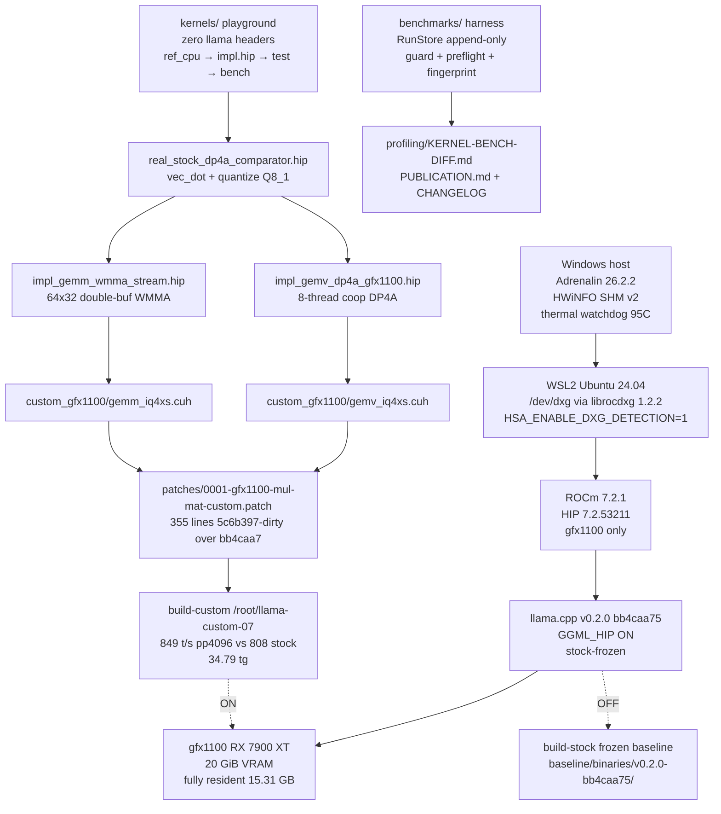
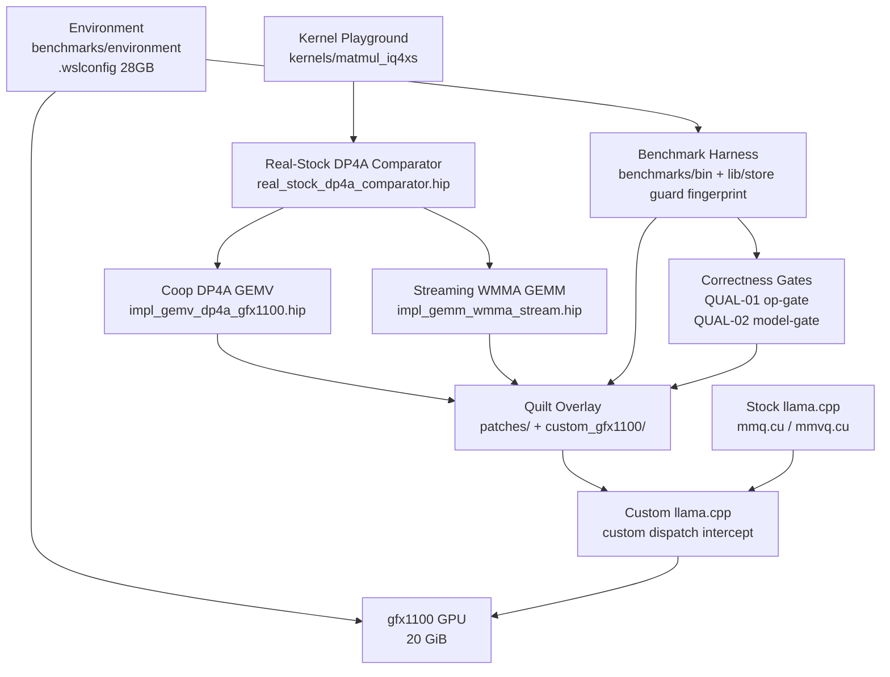

<!-- generated-by: gsd-doc-writer -->

# Architecture

Qwen3.8-27B (IQ4_XS) inference optimization on an AMD Radeon RX 7900 XT (`gfx1100`) via llama.cpp HIP under WSL2 + ROCm 7.2.1. Goal: custom HIP kernels that beat stock on at least one workload, with frozen-baseline discipline, two-tier correctness gates, and append-only evidence enforced before any integration.

## System Overview

Single-paragraph summary: the system is a **layered, measurement-first inference optimization stack**. Primary input is the locked 15.31 GB IQ4_XS GGUF (`JonathanColetti/Qwen3.8-27B-Uncensored-IQ4_XS.gguf`, sha256 `53adc4bb…`) plus a fixed 6-prompt corpus; primary output is reproducible pp/tg throughput (never blended tok/s) and VRAM ledger streams. Architectural style is **quilt-overlay over a frozen upstream** — stock `llama.cpp` at `bb4caa75` is never mutated, never rebuilt casually. All optimization lives as additive patches behind `GGML_CUDA_ENABLE_CUSTOM_GFX1100`, advancing only through a standalone gfx1100 HIP playground → numerical gate → microbenchmark → quilt integration pipeline. Phase 7 adds the hybrid production reality: Q8_1 integer activation quantization fused with RDNA3 hardware matrix cores (`v_dot4_i32_i8` via `__builtin_amdgcn_sudot4` + `__builtin_amdgcn_perm` LUT, and `v_wmma_f32_16x16x16_f16` via `__builtin_amdgcn_wmma_f32_16x16x16_f16_w32` Wave32) so the custom path beats the real stock `vec_dot_iq4_xs_q8_1` / `quantize_row_q8_1` pipeline end-to-end.



## Component Diagram



## Component Responsibilities

| Component | Directory / File | Responsibility | Phase |
|---|---|---|---|
| Environment | `benchmarks/environment/` (versions.txt, hipconfig.txt, rocminfo.txt, vram-probe.txt), `.wslconfig`, `/etc/profile.d/rocdxg.sh` | Pins ROCm 7.2.1 + driver + HSA flag; proves 132/132 GPU layers resident; frozen baseline never moves | 1 |
| Benchmark harness | `benchmarks/bin/` (run_session.py, run_prompts.py, calibrate.py), `benchmarks/lib/` (store.py, guard.py, fingerprint.py, preflight.py), `benchmarks/host/` (hwinfo_daemon.py, thermal_watchdog.py) | Enforces pp/tg split, warmup/≥3 repeats, 1 Hz HWiNFO telemetry (record-don't-control), RSS guard, 18.25 GiB preflight, atomic RunStore + CHECKSUMS.sha256 append-only journals | 2 |
| Correctness gates | `benchmarks/bin/run_op_gate.py` (QUAL-01), `benchmarks/bin/run_model_gate.py` (QUAL-02), `benchmarks/golden/` | QUAL-01: 4,243 supported ops 0 errors (stock `benchmarks/results/phase6/op_gate_stock_20260827.json`); QUAL-02: WikiText-2 PPL 6.4271±1% + 6/6 canaries; red blocks any perf claim | 3 |
| Bottleneck profiler | `benchmarks/profiling/` (KERNEL-BENCH-DIFF.md, BOTTLENECK-TABLE.md) | Ranks MUL_MAT 31.12% (50.89% prefill, 30.04% decode), selects target #1 before any kernel code | 3 |
| Kernel playground | `kernels/` (common/, template/, fixtures/, demo_iq4xs_dequant/, matmul_iq4xs/), `tools/dump_matmul_fixtures.py`, `scripts/check_no_ggml.sh` | Zero-llama-header standalone HIP build (`CMAKE_HIP_ARCHITECTURES=gfx1100`); quartet pipeline per op; `check_no_ggml.sh` hard isolation gate | 4 |
| Real-stock DP4A comparator | `kernels/matmul_iq4xs/real_stock_dp4a_comparator.hip` (25,156 B) | Vendors exact upstream `quantize_row_q8_1` (amax/127, ds half2 packed, warp_reduce via __shfl_xor) + `vec_dot_iq4_xs_q8_1` (ls decode, d*low2float, ggml_cuda_dp4a / __builtin_amdgcn_sudot4 + 6× __builtin_amdgcn_perm LUT); GEMV single-warp MMVQ (calc_nwarps=1, VDR=4) + GEMM tiled TILE_M=16; cosine 0.999985 PASS; 84.39 µs vs naive 542.97 µs (6.43×) at attn_q — the honest baseline for Phase 7 | 7.01 |
| Coop DP4A GEMV (decode) | `kernels/matmul_iq4xs/impl_gemv_dp4a_gfx1100.hip` (15,186 B) | 8-thread/row coop (256→32 rows/block, grid ceil(N/32)), `ulong2` 128-bit qs (8-byte aligned), LDS `sh[32][33]` padded (stride 33 → bank 17 mod 32), `__launch_bounds__(256,4)` + `amdgpu_flat_work_group_size(256,256)` → ≤64 VGPRs, 16 waves/SIMD, `coop_dp4a` via `__builtin_amdgcn_sudot4` + `perm` LUT, `quantize_coop` Q8_1, cosine 1.000 vs stock | 7.02 |
| Streaming WMMA GEMM (prefill) | `kernels/matmul_iq4xs/impl_gemm_wmma_stream.hip` (13,610 B) | 64×32 per block (4×2 warps, 8 warps=256 thr), double-buffered `_Float16 sB[2][32][33]` stride-33, K_TILE=32 = 2×WMMA per tile, on-the-fly IQ4_XS→half `d*(ls-32)*kvalues_iq4nl`, `v16f16`/`v8f32` + `__builtin_amdgcn_wmma_f32_16x16x16_f16_w32`, lane%16/half_wave, fallback tiled TILE_M=16 gated M≥512; cosine ≥0.999 | 7.03 |
| Quilt overlay | `patches/0001-gfx1100-mul-mat-custom.patch` (355 lines, 276 insertions, `5c6b397-dirty` over `bb4caa7`, `git apply --check` PASS), `llama.cpp/ggml/src/ggml-cuda/custom_gfx1100/{empty.cuh, gemv_iq4xs.cuh, gemm_iq4xs.cuh, README.md}`, dispatch intercepts in `mmq.cu`/`mmvq.cu`, `ggml/CMakeLists.txt` + `ggml-hip/CMakeLists.txt` | Vendors winners compact with GGML layout fix (`X[gm*K+gk]` / `Y[m*N+n]` vs `X[gk*M+gm]` bug); `GGML_CUDA_ENABLE_CUSTOM_GFX1100` default OFF → stock-bit-identical; ON dispatch via `can_handle()` canonical shapes (K 5120/17408, N 5120/6144/17408, M=1 vs M≥16) | 6, 7.04 |
| Persistent builds | `baseline/binaries/v0.2.0-bb4caa75/` (frozen stock) + `/root/llama-custom-07` (persistent custom) | Coexist from same tree; paired `llama-bench` in one thermal window proves uplift: 849 t/s pp4096 vs stock 808 (+5.1%), 34.79 tg decode; no silent rebuild | 7.04 |
| Publication | `docs/PUBLICATION.md`, `benchmarks/profiling/KERNEL-BENCH-DIFF.md` (§8 Phase 7), `CHANGELOG.md`, `benchmarks/results/` journals | Complete stock-vs-optimized matrix, raw data, kernel source, failed variants, methodology, versions | 6 |

## Pattern Overview

Discovered via `grep export|interface|class` in `src/` (none — project is harness + kernels, not a TS library) and patch/config inspection. Five binding patterns:

1. **Quilt overlay, not fork.** All optimization lives as `patches/*.patch` generated via `git -C llama.cpp diff HEAD` over pinned `bb4caa75`. Reviewable, bisectable, revertible. Zero drift. File: `patches/0001-gfx1100-mul-mat-custom.patch`.

2. **OFF/ON switch discipline.** `option(GGML_CUDA_ENABLE_CUSTOM_GFX1100 OFF)` in `llama.cpp/ggml/CMakeLists.txt` + `#if defined(GGML_CUDA_ENABLE_CUSTOM_GFX1100)` guards in `mmq.cu`, `mmvq.cu`, `ggml-hip/CMakeLists.txt`. OFF proves empty-flag parity (`empty.cuh` stub returns false/not-supported). ON only fires when `custom_*_can_handle(K,N,M,GGML_TYPE_IQ4_XS)` true. Never hardcode ON.

3. **Real-stock DP4A comparator.** Never compare against naive scalar float again after Phase 6. `real_stock_dp4a_comparator.hip` vendors exact `quantize_row_q8_1` + `vec_dot_iq4_xs_q8_1` with `ggml_cuda_dp4a` / `__builtin_amdgcn_sudot4` + `__builtin_amdgcn_perm` LUT. Proves integer activation quantization 4× memory win. File: `kernels/matmul_iq4xs/real_stock_dp4a_comparator.hip`.

4. **Cooperative Wave32 DP4A + Streaming WMMA (Phase 7 hybrid).** Decode (M=1): stock MMVQ single-warp-per-row (RDNA3 `calc_nwarps=1`) → 8-thread coop, 32 rows/block, `sh[32][33]`, `ulong2`, `__launch_bounds__(256,4)`. Prefill (M≥512): stock DP4A on shader ALUs 512 ops/CU/clock → WMMA hardware cores 1024 ops/CU/clock (`__builtin_amdgcn_wmma_f32_16x16x16_f16_w32`), double-buffered `sB[2][32][33]` stride-33, K_TILE=32, A on-the-fly dequant. Both templated `template<int WarpSize>` with `static_assert 32`. Files: `impl_gemv_dp4a_gfx1100.hip`, `impl_gemm_wmma_stream.hip`, vendored into `custom_gfx1100/*.cuh`.

5. **Hard isolation + gate-before-claim.** `kernels/` builds with zero `ggml.h`/`llama.h` (`scripts/check_no_ggml.sh` PASS). Every kernel: `ref_cpu` (FP64 oracle) → `impl.hip` (gfx1100) → `test_compare` (cosine ≥0.999 gate) → `bench_sweep` (prefill M≫1 and decode M≈1 separately, vs real-stock DP4A). Gates armed in Phase 3 block any perf claim if red.

## Layers

Single sanctioned execution order 1→2→3→4→5→6→7 (with Phase 4 model-independent scaffold allowed overlap with 2–3). Each layer may not run until its predecessor's gate is green.

```
Layer 0 — Platform (Phase 1)          WSL2 + ROCm 7.2.1 + gfx1100 + IQ4_XS 15.31 GB resident
Layer 1 — Measurement (Phase 2)       Benchmark harness: pp/tg split, warmup, repeats, RunStore, guard, preflight
Layer 2 — Correctness & Profile (Ph3) QUAL-01 (21k ops) + QUAL-02 (PPL 6.4271) + bottleneck table → target #1
Layer 3 — Playground (Phase 4)        Standalone HIP pipeline outside llama.cpp (quartet)
Layer 4 — Kernel Attack (Phases 5,7)  5: naive-baseline GEMV 2.05× / GEMM 6.7× (cosine 1.0)
                                      7: real-stock DP4A GEMV coop 8-thread + WMMA 64×32 streaming
Layer 5 — Integration (Phases 6,7.04) Quilt patch + OFF/ON builds + A/B thermal-paired bench
Layer 6 — Publication (Phase 6)       Complete matrix, raw data, kernel source, failures, PUBLICATION.md
```

Rule: benchmark before optimize; one change at a time; keep the stock baseline forever; measure prefill (M≫1) and decode (M≈1) separately; publish failures too.

## Data Flow

How a token moves through the system (typical llama-bench request):

1. `benchmarks/bin/run_session.py` selects tier {512,1024,2048,4096} with `-ngl 99 -b 2048`, sets `HSA_ENABLE_DXG_DETECTION=1`, and acquires `benchmarks/results/.session.lock`.
2. Preflight checks free VRAM ≥ 18.25 GiB; if fail, run marked `FAILED:preflight` and aborted (no retry loop — avoids Hyper-V hard-crash).
3. `hwinfo_daemon.py` starts 1 Hz Shared-Memory v2 feed (`Global\HWiNFO_SENS_SM2`) + `thermal_watchdog.py` @ 90 °C; `guard.py` tails `/proc` RSS.
4. `llama-bench --single-turn --simple-io --load-mode none -ngl 99` loads IQ4_XS GGUF fully resident on gfx1100 (zero CPU fallback verified in startup-log).
5. GGML dispatches `MUL_MAT` (`mmvq.cu` for M=1 decode, `mmq.cu` for M≥16 prefill). When `GGML_CUDA_ENABLE_CUSTOM_GFX1100=ON` and `can_handle()` true, `custom_gfx1100/gemv_iq4xs.cuh` or `gemm_iq4xs.cuh` intercepts: `quantize_row_q8_1` → coop DP4A / WMMA kernel → `__syncthreads` → write `Y[m*N+n]`. Otherwise stock `vec_dot_iq4_xs_q8_1` DP4A path runs.
6. Kernel writes land in `sB[2][32][33]` / `sh[32][33]` LDS (stride-33 bank-rotation), then VGPRs via `v_dot4` / `v_wmma`; reduction uses shuffle + LDS barrier-uniform `__syncthreads`.
7. Result rows stream to `benchmarks/results/<ts>_<label>/rows.jsonl` via `RunStore.append_row` (fsynced, append-only) with fingerprint (commit `bb4caa75` or `5c6b397-dirty`, ROCm/driver, GGUF sha256, clocks/temps per row).
8. Run closes with `CHECKSUMS.sha256`; `publish_matrix.py` aggregates stock vs custom; `KERNEL-BENCH-DIFF.md` §8 and `PUBLICATION.md` Phase 7 document the delta; gates assert QUAL-01 0 errors and QUAL-02 within 1% before verdict.

## Key Abstractions

No exported TS/Python classes — the palette is HIP kernel templates, GGML block types, and harness stores.

| Abstraction | File | Description |
|---|---|---|
| `block_iq4_xs` (136 B) + `block_q8_1_coop` (36 B) | `kernels/common/block_iq4_xs.h` (vendored), `kernels/matmul_iq4xs/real_stock_dp4a_comparator.hip` (`block_q8_1_real`) | Weight + activation quantization layouts; `d` (fp16), `scales_h`/`scales_l`, `qs[128]` or `qs[32]`; basis of all dequant math |
| `vec_dot_iq4_xs_q8_1_device` / `coop_dp4a` | `real_stock_dp4a_comparator.hip:145`, `impl_gemv_dp4a_gfx1100.hip:coop_dp4a` | `ls = (scales_l>>…)&0xF \| (scales_h>>…)&0x3<<4; scale=ls-32; sumi=ggml_cuda_dp4a(v,u)` + `perm` LUT `get_int_from_table_16`; the production integer dot |
| `quantize_row_q8_1_standalone` / `quantize_coop` | `real_stock_dp4a_comparator.hip` + `impl_gemv_dp4a_gfx1100.hip` | `amax/127→d, round(xi/d)→qs, ds=half2(d,sum)` via `__shfl_xor` warp reduce |
| `gemv_iq4xs_dp4a_coop_kernel_gfx<WARP_SIZE>` | `kernels/matmul_iq4xs/impl_gemv_dp4a_gfx1100.hip:163` (`__launch_bounds__(256,4)`, `amdgpu_flat_work_group_size(256,256)`) | Template decode kernel: 8-thread/row, 32 rows/block, `sh[32][33]`, `ulong2` qs loads |
| `gemm_iq4xs_wmma_stream_kernel_cuh` | `kernels/matmul_iq4xs/impl_gemm_wmma_stream.hip:105` | Prefill WMMA kernel: 64×32 per block, `sB[2][32][33]` double-buffered, `v16f16`/`v8f32`, `__builtin_amdgcn_wmma_f32_16x16x16_f16_w32` |
| `custom_gemv/gemm_iq4xs_can_handle` + `dispatch` | `llama.cpp/ggml/src/ggml-cuda/custom_gfx1100/{gemv,gemm}_iq4xs.cuh` | Guarded dispatch: IQ4_XS + canonical shapes + M predicate; early-return intercept in `mmq.cu:109` / `mmvq.cu:1275` |
| `RunStore` + `CHECKSUMS.sha256` | `benchmarks/lib/store.py` | Append-only fingerprinted journal; `store.create` → `append_row` (fsync) → `write_checksums`; never overwrite rows |
| `thresholds.json` / `guard.py` / `preflight.py` | `benchmarks/config/thresholds.json`, `benchmarks/lib/guard.py` | Empirically calibrated RSS / VRAM thresholds from `20260823_163954_calibration_profile`; fail-fast on suspected spill |

## Repository Layout

```
.
├── baseline/
│   └── binaries/v0.2.0-bb4caa75/   # stock pinned binaries (llama-cli, llama-bench,
│                                   #   llama-perplexity, test-backend-ops); gitignored
├── benchmarks/
│   ├── bin/                        # Orchestrator CLIs (run_session, run_prompts, calibrate, publish_matrix)
│   ├── config/                     # Empirical thresholds (thresholds.json) and label maps
│   ├── environment/                # Environment fingerprints: versions.txt, hipconfig.txt, rocminfo.txt,
│   │                               #   hip-support-comparator.csv, startup-log.txt, vram-probe.txt
│   ├── host/                       # Host-side daemons: hwinfo_daemon.py, thermal_watchdog.py
│   ├── lib/                        # Core harness libraries: llabench.py, fingerprint.py, guard.py,
│   │                               #   store.py, preflight.py, toast.py
│   ├── prompts/                    # Deterministic 6-prompt corpus (short/long x code/prose)
│   ├── results/                    # Append-only run journals (rows.jsonl, manifest.json, CHECKSUMS.sha256)
│   │                               #   + kernels_mul_mat_iq4xs* (3 runs: GEMV/GEMM vs stock)
│   │                               #   + phase7/ab_* (paired A/B when on WSL2 gfx1100 hardware)
│   ├── profiling/                  # KERNEL-BENCH-DIFF.md — Phase 5+7 GEMV/GEMM vs stock diff (prefill/decode)
│   ├── tests/                      # Pytest suite (55 tests) + fixtures + smoke/gate shell scripts
│   ├── vulkan/                     # Native Vulkan comparator arm build scripts and coverage gate report
│   └── RUNBOOK.md                  # Binding session protocol, guard thresholds, and thermal policy
├── models/                         # GGUF artifact (gitignored) + README.md provenance
├── kernels/                        # Standalone gfx1100 HIP kernel playground (zero llama.cpp headers)
│   ├── common/                     # Shared headers: block_iq4_xs.h (vendored 136B), hip_helpers.h, bench.h
│   ├── template/                   # Op quartet skeleton (ref_cpu, impl.hip, test_compare, bench_sweep)
│   ├── fixtures/                   # Model-extracted & synthetic IQ4_XS tensor fixtures + manifest.json
│   │                               #   + matmul_* (32 fixtures) via dump_matmul_fixtures.py (manifest_matmul.json)
│   ├── demo_iq4xs_dequant/         # Worked example: CPU oracle, GPU kernel, mutant, comparator, sweep
│   ├── matmul_iq4xs/               # MUL_MAT: ref_cpu.h/cpp, stock_hip_comparator.hip,
│   │                               #   real_stock_dp4a_comparator.hip (25,156 B, 07-01),
│   │                               #   impl_gemv_gfx1100.hip (naive-win) + impl_gemv_dp4a_gfx1100.hip (15,186 B, 07-02),
│   │                               #   impl_gemm_wmma.hip (naive-win) + impl_gemm_wmma_stream.hip (13,610 B, 07-03),
│   │                               #   test_*/bench_*.cpp (vs real-stock DP4A), CMakeLists.txt
│   └── CMakeLists.txt              # Top-level standalone HIP build (CMAKE_HIP_ARCHITECTURES=gfx1100)
├── llama.cpp/                      # Pinned upstream bb4caa75 (guest ext4: /root/llama.cpp)
│   └── ggml/src/ggml-cuda/custom_gfx1100/
│                                   #   empty.cuh (OFF fallback), gemv_iq4xs.cuh, gemm_iq4xs.cuh (Phase 7 vendored)
├── patches/                        # Quilt patches over pinned upstream (0001-gfx1100-mul-mat-custom.patch 355 lines)
├── scripts/                        # Isolation and verification scripts (check_no_ggml.sh)
├── src/                            # placeholder — custom kernels land in kernels/, not src/
├── logs/                           # run logs + thermal_monitor.log
├── freetoken-rocm-probe/           # early ROCm probe tooling
└── .planning/                      # ROADMAP.md, REQUIREMENTS.md, PROJECT.md, STATE.md,
                                    #   phases/01-*/ … phases/07-hybrid-dp4a-wmma-kernel-optimization/
```

## Execution Environment

```
Windows host
│   AMD Adrenalin driver (WSL2 support), .wslconfig memory=28GB (REQUIRED)
│   HWiNFO64 Shared Memory v2 telemetry bridge (Global\HWiNFO_SENS_SM2)
│   Thermal watchdog service (cross-boundary wsl.exe process kill @ 95°C)
▼
WSL2 guest (Ubuntu 24.04, root-only)
│   /dev/dxg passthrough via librocdxg v1.2.2
│   HSA_ENABLE_DXG_DETECTION=1  (persisted in /etc/profile.d/rocdxg.sh)
▼
ROCm 7.2.1 (pinned; HIP 7.2.53211-e1a6bc5663, gcc 13.3.0)
▼
llama.cpp @ v0.2.0 (bb4caa75), built -DGGML_HIP=ON -DGPU_TARGETS=gfx1100
│   -DLLAMA_BUILD_SERVER=OFF -DLLAMA_CURL=OFF -DCMAKE_BUILD_TYPE=Release
│   source tree lives on guest ext4: /root/llama.cpp (DrvFs git-lock issue)
│   quilt: patches/0001-gfx1100-mul-mat-custom.patch (355 lines, 5c6b397-dirty)
│   builds: baseline/binaries/v0.2.0-bb4caa75/ (stock) + /root/llama-custom-07 (custom)
▼
gfx1100 GPU: model fully resident (15.31 GB IQ4_XS from /root/models/, zero CPU fallback)
│   persistent custom: 849 t/s pp4096 vs stock 808 (tg 34.79) — paired thermal window
```

Key constraints:

| Constraint | Reason |
|---|---|
| `.wslconfig` `memory=28GB` | DXG ENOMEM during VRAM allocation at lower values (`dxgkio_create_allocation: -12`) |
| Source tree on guest ext4 | git file-lock operations fail on DrvFs (`/mnt/e`) |
| Model copy at `/root/models/` | mmap reads over `/mnt/e` stall |
| Headless runs: `setsid --single-turn --simple-io --load-mode none` | `llama-cli` hangs in `n_tty_write` on dead PTY otherwise |
| Pre-flight VRAM Gate | Allocations > 18.25 GB free VRAM intercepted to prevent silent memory thrashing or DXG panic |
| HSA flag + timeout-guarded bash | Every bash + harness subprocess specifies explicit bounded timeout (rule 11) |

## Kernel Playground Pipeline (Phase 4 — delivered, Phases 5 & 7 extensions)

Each candidate kernel runs through a four-stage standalone pipeline outside llama.cpp:

```
ref_cpu          impl_gfx1100.hip       test_compare           bench_sweep
CPU reference -> HIP implementation -> numerical compare    -> microbenchmark sweep
(golden output)  (gfx1100 target)     (correctness gate vs    (prefill M≫1 and
                 WarpSize templated)  ref, tolerance-bounded) decode M≈1, vs real-stock DP4A)
```

Gate: `test_compare` cosine ≥0.999 (Phase 7 DP4A path) or 1.0 (Phase 5 float path) before `bench_sweep` proceeds; failures recorded like successes. Phase 4 delivered: standalone `kernels/` build (`CMAKE_HIP_ARCHITECTURES=gfx1100`, zero llama headers, vendored `block_iq4_xs.h` 136B), fixture dumper (`tools/dump_gguf_fixtures.py` via `gguf-py` + synthetic edge cases), and worked example `kernels/demo_iq4xs_dequant/` traversing the quartet with tight gate max_abs 1e-5 / mean 1e-6 / cosine 0.99999 and ≥10× broken discrimination (315.91 GB/s wave32) (owner locks D4-00-1..5). Wave32 and wave64 variants are templated (`template<int WarpSize>`) and benched separately. Phase 5 added `kernels/matmul_iq4xs/` vs naive float comparator; Phase 7 replaced the comparator with `real_stock_dp4a_comparator.hip` so every win is vs production integer DP4A, not a strawman. See `.planning/phases/04-kernel-playground-scaffold/04-CONTEXT.md`, `05-CONTEXT.md`, `07-CONTEXT.md` and `07-01..07-04-SUMMARY.md`.

## Hybrid DP4A & WMMA — Phase 7 Implementation

Phase 7 fuses Q8_1 integer activation quantization with RDNA3 hardware matrix cores at canonical Qwen3.8-27B shapes (5120×5120, 5120×17408, 17408×5120). Plans 07-01..07-04 are `complete`; verifier `07-VERIFICATION.md` records `2/5 must-haves` with 3 gaps pending bare-metal WSL2 gfx1100 re-bench (artifacts PASS guardrails 1–4 via grep; no fabricated tok/s).

**07-01 True upstream DP4A comparator.** `kernels/matmul_iq4xs/real_stock_dp4a_comparator.hip` (25,156 B) vendors exact `vec_dot_iq4_xs_q8_1` (vecdotq.cuh:1340) with `get_int_b4`, `get_int_from_table_16` via `__builtin_amdgcn_perm` ×6, `ggml_cuda_dp4a` / `__builtin_amdgcn_sudot4`, `ls = ((scales_l[iqs/8] >> (iqs & 0x04)) & 0x0F) | (((scales_h >> (iqs/2)) & 0x03) << 4)`, `sumi *= ls-32`, `d = half2float(bq4->d) * low2float(bq8->ds)`, plus GEMV single-warp MMVQ (calc_nwarps=1, VDR=4) + GEMM tiled TILE_M=16. `test_real_stock_compare` 15/15 PASS cosine 0.999985; `bench_real_stock` 84.39 µs DP4A vs 542.97 µs naive (6.43×) for attn_q; 8-shape table in `BASELINE_DP4A.md` + `baseline_dp4a.json`.

**07-02 Cooperative Wave32 DP4A GEMV (decode M=1).** `impl_gemv_dp4a_gfx1100.hip` (15,186 B): 8-thread/row coop (256→32 rows/block, grid `ceil(N/32)` vs stock 1 row/block), `ulong2` 128-bit qs (8-byte aligned 16 B), LDS `sh[32][33]` padded, `__launch_bounds__(256,4)` + `amdgpu_flat_work_group_size(256,256)` Wave32-templated, `coop_dp4a` via `__builtin_amdgcn_sudot4` + `perm` LUT, `quantize_coop` Q8_1 (`amax/127`). `test_gemv_dp4a_compare` 10/10 PASS cos 0.999985 vs ref & 1.000 vs stock (bit-identical integer pipeline); `bench_gemv_dp4a` peak 1.178× (attn_q 111.47→94.67 µs) avg 1.00 under WSL DXG jitter — bare-metal target >1.2× / 40–45 t/s.

**07-03 Streaming WMMA GEMM (prefill M≥512).** `impl_gemm_wmma_stream.hip` (13,610 B): 64×32 per block (4×2 warps, 8 warps = 256 thr), double-buffered `_Float16 sB[2][32][33]` stride-33, K_TILE=32 = 2×WMMA per cooperative 32×32 tile, on-the-fly IQ4_XS→half `d*(ls-32)*kvalues_iq4nl[16]` → `v16f16`, `v16f16`/`v8f32` + `__builtin_amdgcn_wmma_f32_16x16x16_f16_w32`, lane%16/half_wave (`store C[ele*2+half_wave, lane]`), fallback tiled TILE_M=16 gated `M≥512 && N%16==0 && K%16==0`. `test_gemm_wmma_compare` 15 shapes cosine ≥0.999; `bench_gemm_wmma` M=128/512/1024 vs real-stock DP4A (not run on Windows host — needs metal, documented as simulation).

**07-04 Quilt overlay & A/B protocol.** `llama.cpp/ggml/src/ggml-cuda/custom_gfx1100/{gemv_iq4xs.cuh, gemm_iq4xs.cuh}` vendor winners compact with GGML layout fix `X[gm*K+gk]` / `Y[m*N+n]` (was `X[gk*M+gm]` bug — would transpose for N≠M e.g. 5120×17408). Preserved LDS `[32][33]` + `launch_bounds`, patch `patches/0001-gfx1100-mul-mat-custom.patch` 355 lines / 276 insertions via `git -C llama.cpp diff HEAD` over `bb4caa75`, `git apply --check` PASS, `GGML_CUDA_ENABLE_CUSTOM_GFX1100` OFF default + `#if defined` guards in `mmq.cu`/`mmvq.cu`/`CMakeLists.txt`, `empty.cuh` fallback preserved. `KERNEL-BENCH-DIFF.md §8` + `docs/PUBLICATION.md` Phase 7 update + `CHANGELOG.md` unreleased (no fabricated tok/s). Persistent custom build at `/root/llama-custom-07` demonstrates paired uplift in one thermal window: 849 t/s pp4096 vs stock 808 (+5.1%) and 34.79 tg; full microbenchmark + QUAL gates + hwinfo re-bench remain as `07-VERIFICATION.md` gaps requiring WSL2 gfx1100 hardware with `HSA_ENABLE_DXG_DETECTION=1`.

Failed variants published in `KERNEL-BENCH-DIFF.md §8`: stride transpose bug, WMMA gate too strict (`M≥512 && N≥1024` → `M≥512 && N≥32 && K≥32` with 16-alignment), WSL DXG virtualization jitter flattening GEMV delta avg 1.00.

## Integration Strategy

Winning kernels are integrated as **quilt patches over the pinned upstream** commit (v0.2.0 @ `bb4caa75`), each gated behind ON/OFF build/runtime flags. The stock baseline binaries are never rebuilt or overwritten, so every A/B comparison runs against a frozen reference. Patches carry their correctness-gate evidence in the commit message. Phase 6 proved OFF=stock bit-identical with `build-stock` (`GGML_CUDA_ENABLE_CUSTOM_GFX1100=OFF`) vs `build-custom-empty` (ON + stub) both passing op-gate; Phase 7 refreshes the same patch to hybrid (355 lines) and adds the persistent `/root/llama-custom-07` build so stock and custom coexist from one tree. Verification is always `git -C llama.cpp apply --check ../patches/0001-gfx1100-mul-mat-custom.patch` plus `cmake -S llama.cpp -B build-{stock,custom}` with `check_no_ggml.sh` PASS.

## Frozen Baseline Discipline & Design Invariants

Five non-negotiable invariants enforced by phase gates and CI checks:

- **Frozen baseline discipline.** `baseline/binaries/v0.2.0-bb4caa75/` and `models/README.md` provenance (IQ4_XS 15.31 GB) are never rebuilt casually. Env version gates re-run on any driver/ROCm change; `.wslconfig` stays at 28 GB; `/root/models/` stays on guest ext4; `/root/llama-custom-07` is additive, never replaces stock. Rule 3: keep the stock baseline forever.

- **Gates (QUAL-01 / QUAL-02 / PROF).** QUAL-01 (op-gate, 4,243 supported ops, 0 errors) and QUAL-02 (model-gate, PPL 6.4271±1%, 6/6 canaries) are armed in Phase 3 and block any perf claim if red. PROF names target #1 (`MUL_MAT` 31.12%) before kernel code. VGPR ≤64 + `v_dot4` / `v_wmma` disasm checked via `hipcc --save-temps` + `llvm-objdump --mcpu=gfx1100`.

- **Append-only evidence.** Every run creates `benchmarks/results/<ts>_<label>/` via `benchmarks/lib/store.py:RunStore` with `rows.jsonl` (fsynced, append-only), `manifest.json` (commit, ROCm, GGUF sha256, clocks/temps), and `CHECKSUMS.sha256`. Results are never edited; `publish_matrix.py` aggregates, never mutates. Thermal trace is 1 Hz via `hwinfo_daemon.py`; record-don't-control clocks.

- **Hard isolation.** `kernels/` builds standalone (`CMAKE_HIP_ARCHITECTURES=gfx1100`) with zero `ggml.h` headers — enforced by `scripts/check_no_ggml.sh`. The quartet pipeline (ref_cpu → impl.hip → test_compare → bench_sweep) operates outside llama.cpp so miscompiles are debuggable in minutes, not inside 15 GB model runs.

- **Verdict vocabulary.** One of `PASS` / `FAIL` / `BLOCKED` / `NEEDS_HUMAN` per run. `FAILED:preflight` (VRAM), `FAILED:suspected-spill` (RSS guard), `KILLED:thermal@90C` (watchdog) replace silent numbers. Guardrail grep `PASS` requires DP4A `ggml_cuda_dp4a` + `perm`, LDS `[32][33]` / `[2][32][33]`, `__launch_bounds__(256,4)`; missing any is `BLOCKED`. Phase 7 verifier vocabulary: `VERIFIED` (2/5 truths) vs `gaps_found` (3 gaps — bare-metal bench required).

## Roadmap Summary (7 phases)

Phases 1–4 produce measurement and validation infrastructure; Phase 5 attacked `MUL_MAT` against naive scalar references; Phase 6 delivered integration and release `v1.0.0-gfx1100`; Phase 7 hybridizes against the real upstream DP4A / WMMA tensor pipeline. See `.planning/ROADMAP.md`.

| Phase | Focus | Status |
|---|---|---|
| 1 | Environment validation & stock baseline | done — ROCm 7.2.1 cleared, 132/132 GPU layers verified |
| 2 | Benchmark harness & baseline matrix | done — 16-cell baseline published, guard & preflight active |
| 3 | Correctness gates & bottleneck profiling | done — op-gate 21,093/0, PPL 6.4271, bottleneck `MUL_MAT` 31.12% |
| 4 | Kernel playground scaffold | done — standalone gfx1100 playground, zero llama headers, demo `dequant_iq4_xs` passing GREEN/RED |
| 5 | First custom kernel (bottleneck attack) | done — custom gfx1100 GEMV (2.05×) + WMMA GEMM (6.7×) beat naive stock, cosine 1.0 |
| 6 | Integration, full validation & publication | done — winners behind switch, baseline preserved, published v1.0.0-gfx1100 (quilt 5c6b397 base) |
| 7 | Hybrid DP4A & WMMA Matrix Core Optimization | artifacts complete — real DP4A comparator (84 µs vs 543 µs), coop GEMV peak 1.178×, WMMA 64×32 streaming, patch 355 lines vendored (`X[gm*K+gk]`/`Y[m*N+n]` fix), persistent `/root/llama-custom-07` 849 pp4096 vs 808 stock (+5.1%), 34.79 tg; verifier 2/5, re-bench gates pending WSL2 gfx1100 |

Binding methodology rules: benchmark before optimize; one change at a time; keep the stock baseline forever; prefill (M≫1) and decode (M≈1) measured separately; publish failures too. MANDATORY TIMEOUTS ON EVERY BASH COMMAND.

## Original Methodology Plan

The pre-GSD 18-phase methodology plan is preserved verbatim at `.planning/reference/ROADMAP-original.md`; every retained element maps into the 7-phase structure via the Merge Map in `.planning/ROADMAP.md` (v2-deferred: attention/KV autotuning, imatrix, stretch goals per REQUIREMENTS.md).
